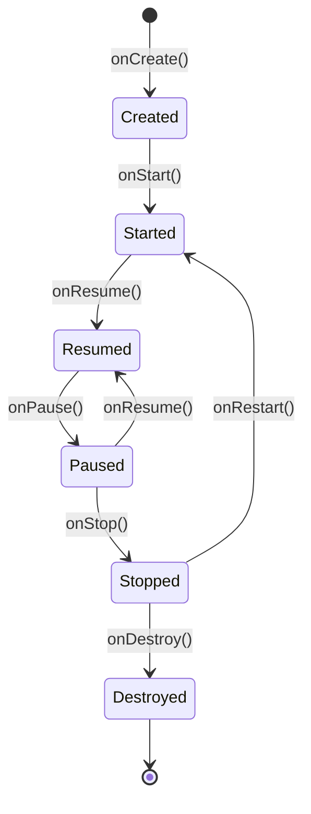

# Aktywność (Activity) i jej cykl życia

---

## Co to jest `Activity`?

**`Activity`** to jeden z podstawowych komponentów aplikacji Android. Reprezentuje **pojedynczy ekran interfejsu użytkownika** – czyli wszystko, co widzi i z czym wchodzi w interakcję użytkownik w danym momencie. 

Każda aplikacja musi mieć co najmniej jedną aktywność, najczęściej jest to ekran główny (`MainActivity`). Aktywność zarządza cyklem życia ekranu, reaguje na działania użytkownika, obsługuje zdarzenia systemowe (np. obrót ekranu, powrót do aplikacji) oraz odpowiada za wyświetlanie i aktualizowanie interfejsu.

W tradycyjnym Androidzie aktywność definiuje się jako klasę dziedziczącą po `Activity` lub `AppCompatActivity`, np.:

```kotlin
class MainActivity : ComponentActivity() {
    override fun onCreate(savedInstanceState: Bundle?) {
        super.onCreate(savedInstanceState)
        setContent {
            MyApp()
        }
    }
}
```

> **Plik `AndroidManifest.xml`:** Każda aktywność musi być zadeklarowana w pliku `AndroidManifest.xml` – bez tego system Android nie będzie wiedział o jej istnieniu. Plik manifestu omawia osobny rozdział, tu ważne jest, że samo napisanie klasy nie wystarcza.

---

## Architektura Single Activity

Nowoczesne aplikacje Android (szczególnie oparte na Jetpack Compose) opierają się na wzorcu **Single Activity** – cała aplikacja działa w ramach jednej Activity, a poszczególne ekrany to osobne funkcje kompozycyjne, między którymi nawiguje się za pomocą **Jetpack Navigation** .

```
MainActivity
 └── NavHost
      ├── HomeScreen()       ← composable
      ├── DetailsScreen()    ← composable
      └── ProfileScreen()    ← composable
```

Podejście to ma kilka zalet w porównaniu z klasycznym modelem wielu Activity:

| Cecha                      | Wiele Activity                        | Single Activity + Compose          |
|----------------------------|---------------------------------------|------------------------------------|
| Nawigacja                  | Intencje (`Intent`)                   | `NavController`                    |
| Przekazywanie danych       | `Intent.putExtra()`                   | Argumenty nawigacji lub ViewModel  |
| Animacje przejść           | Trudniejsze do dostosowania           | Wbudowane w Navigation Compose     |
| Współdzielenie stanu       | Skomplikowane (przez Intent lub Bus)  | Łatwe przez współdzielony ViewModel  |

> Nawigacja w Compose jest omawiana w osobnym rozdziale (rozdział 6: [Komponent nawigacji](https://github.com/MarcinRod/AndroidLecture2025/blob/main/06%20Komponent%20nawigacji.md) ). W tym kursie tworzy się aplikacje w oparciu o Single Activity.

## Cykl życia aktywności

Aktywności w Androidzie podlegają cyklowi życia, który jest zarządzany przez system operacyjny. Cykl życia składa się z **serii metod wywoływanych automatycznie** przez system w zależności od interakcji użytkownika, stanu urządzenia czy zasobów.

---

## Schemat cyklu życia



---

## Opis metod cyklu życia

| Metoda         | Opis |
|----------------|------|
| `onCreate()`   | Wywoływana przy pierwszym tworzeniu aktywności. Tu inicjalizuje się interfejs użytkownika, ustawia widoki, odczytuje dane z `savedInstanceState`, rejestruje listenery, inicjalizuje ViewModel i otwiera połączenia z bazą danych itp. |
| `onStart()`    | Aktywność staje się widoczna dla użytkownika, ale jeszcze nie jest na pierwszym planie. Można tu np. rozpocząć animacje lub przygotować zasoby, które są potrzebne, gdy aktywność jest widoczna. |
| `onResume()`   | Aktywność uzyskuje fokus i staje się aktywna (gotowa na interakcję). Tu wznawia się wstrzymane operacje, np. odtwarzanie wideo, uruchamianie czujników, wznawianie animacji. |
| `onPause()`    | Aktywność traci fokus, np. po otwarciu innej aktywności lub dialogu. Tu należy zapisać tymczasowe dane, zatrzymać animacje, wstrzymać odtwarzanie multimediów, wyrejestrować odbiorniki, zatrzymać czujniki. |
| `onStop()`     | Aktywność nie jest już widoczna. Tu należy zwolnić zasoby, zapisać dane do trwałego magazynu, zamknąć połączenia z bazą danych i zatrzymać ciężkie operacje. |
| `onRestart()`  | Wywoływana, gdy aktywność wraca na pierwszy plan po zatrzymaniu (`onStop`). Można tu ponownie zainicjalizować zasoby zwolnione w `onStop()`. |
| `onDestroy()`  | Aktywność jest niszczona – np. po zamknięciu lub przy zmianie konfiguracji. Tu należy zwolnić wszystkie zasoby, wyrejestrować listenerów, zamknąć połączenia, zatrzymać wątki. |

---

### Przykłady użycia metod cyklu życia

- **onCreate()**: Inicjalizacja UI, ustawienie adapterów, pobranie danych z bazy, rejestracja listenerów.
- **onStart()**: Rozpoczęcie animacji, rejestracja BroadcastReceiver, sprawdzenie uprawnień.
- **onResume()**: Wznowienie odtwarzania muzyki, uruchomienie kamery, rozpoczęcie śledzenia lokalizacji.
- **onPause()**: Zatrzymanie odtwarzania wideo, zapisanie szkicu formularza, wyrejestrowanie czujników.
- **onStop()**: Zapisanie danych do bazy, zamknięcie połączenia z API, zatrzymanie usług.
- **onDestroy()**: Zwolnienie pamięci, zamknięcie połączeń sieciowych, wyrejestrowanie listenerów.

---

## Dlaczego to ważne?

Zrozumienie cyklu życia aktywności pozwala na:

- **Oszczędzanie baterii i zasobów**  
  Przykład: zatrzymywanie odtwarzania wideo, muzyki lub czujników w `onPause()` i `onStop()`, aby nie zużywać niepotrzebnie energii, gdy użytkownik nie korzysta z aplikacji.
- **Unikanie błędów przy zmianie orientacji**  
  Przykład: zapisanie stanu formularza lub przewinięcia listy w `onSaveInstanceState()` i odtworzenie go w `onCreate()`, aby użytkownik nie stracił danych po obrocie ekranu.
- **Zachowanie stanu aplikacji**  
  Przykład: zapisywanie tymczasowych danych (np. tekstu w polu edycji) podczas przechodzenia do innej aplikacji, aby po powrocie użytkownik mógł kontynuować pracę.
- **Lepsza kontrola nad zewnętrznymi zasobami**  
  Przykład: zamykanie połączeń z bazą danych, zatrzymywanie usług lokalizacyjnych, wyrejestrowywanie odbiorników systemowych, aby nie powodować wycieków pamięci i niepotrzebnego zużycia zasobów.
- **Bezpieczeństwo i prywatność**  
  Przykład: ukrywanie wrażliwych danych lub wylogowywanie użytkownika po dłuższej nieaktywności.
- **Poprawa wydajności aplikacji**  
  Przykład: ładowanie dużych danych tylko wtedy, gdy aktywność jest widoczna, a nie w tle.

Dzięki prawidłowemu zarządzaniu cyklem życia aplikacja działa płynnie, jest stabilna i nie zużywa niepotrzebnie zasobów urządzenia.

---

## Zmiany konfiguracji

**Zmiana konfiguracji** (ang. *configuration change*) to zdarzenie systemowe powodujące zniszczenie i ponowne utworzenie Activity. Najczęstszym przykładem jest **obrót ekranu**, ale dotyczy to także zmiany języka systemu, rozmiaru okna (tryb wielookienkowy) czy podłączenia klawiatury.

### Przebieg przy obrocie ekranu

```
onPause() → onStop() → onDestroy()  ← stara instancja
onCreate() → onStart() → onResume() ← nowa instancja
```

Każde pole klasy Activity jest resetowane do wartości domyślnych. Dane niechronione w ten sposób (np. wypełniony formularz, pobrana lista) zostaną utracone.

### Rozwiązania

- **`ViewModel`** – zalecane podejście. Dane przechowywane w ViewModelu przeżyją zmianę konfiguracji, ponieważ ViewModel nie jest niszczony razem z Activity. 
- **`rememberSaveable`** (Compose) – przechowuje stan funkcji kompozycyjnej w `Bundle`, który jest odtwarzany po zmianie konfiguracji. Odpowiednik `onSaveInstanceState` po stronie Compose.
- **`onSaveInstanceState`** – tradycyjny mechanizm zapisywania prostych danych (stringów, liczb) do `Bundle` przed zniszczeniem Activity.

> W tym kursie głównym narzędziem do obsługi zmian konfiguracji będzie **ViewModel**, omówiony w rozdziale poświęconym architekturze aplikacji ([Architetura aplikacji](https://github.com/MarcinRod/AndroidLecture2025/blob/main/010%20Architektura%20aplikacji.md)).

### Co to jest `Context`?

**`Context`** to jedna z najważniejszych klas w Androidzie. Reprezentuje **bieżący stan aplikacji** i zapewnia dostęp do zasobów systemowych, plików, baz danych, preferencji, usług systemowych oraz informacji o środowisku, w którym działa aplikacja.

### Najważniejsze zastosowania `Context`

- **Dostęp do zasobów**: np. `getString(R.string.app_name)`, `getDrawable(R.drawable.icon)`
- **Uruchamianie nowych aktywności i usług**: np. `startActivity(intent)`, `startService(intent)`
- **Dostęp do plików i baz danych**: np. `openFileInput()`, `openOrCreateDatabase()`
- **Dostęp do preferencji**: np. `getSharedPreferences()`
- **Uzyskiwanie usług systemowych**: np. `getSystemService(Context.CONNECTIVITY_SERVICE)`


### Typowe klasy dziedziczące po `Context`

- **`Application`** – kontekst globalny, żyje tak długo jak aplikacja.
- **`Activity`** – kontekst powiązany z pojedynczym ekranem.
- **`Service`** – kontekst powiązany z usługą.
- **`BroadcastReceiver`** – dostępny przez krótką chwilę w metodzie `onReceive()`.

### `Context` w Compose

W Compose nie ma bezpośredniego dostępu do kontekstu (jak w Activity przez `this`), dlatego korzysta się z funkcji pomocniczych.


W funkcjach kompozycyjnych używamy:

```kotlin
val context = LocalContext.current
```

### Przykłady użycia `Context` w Compose

- **Dostęp do zasobów:**

  ```kotlin
  val context = LocalContext.current
  val appName = context.getString(R.string.app_name)
  ```


- **Start nowej aktywności:**

  ```kotlin
  val context = LocalContext.current
  Button(onClick = {
      val intent = Intent(context, DetailsActivity::class.java)
      context.startActivity(intent)
  }) {
      Text("Przejdź dalej")
  }
  ```

- **Uzyskanie usługi systemowej:**

  ```kotlin
  val context = LocalContext.current
  val connectivityManager = context.getSystemService(Context.CONNECTIVITY_SERVICE) as ConnectivityManager
  ```

### Ważne wskazówki

- **Nie należy przechowywać referencji do `Context` poza funkcją kompozycyjną.**  
  Aktualny kontekst należy pobierać przez `LocalContext.current` w ciele funkcji kompozycyjnej lub lambdzie onClick.
- **Do operacji globalnych (np. repozytoria, ViewModel)** należy używać `context.applicationContext`.
- **Do operacji związanych z UI** (np. Toast, startActivity) należy używać bieżącego kontekstu z `LocalContext`.

---

## Dodatkowe materiały i dokumentacja

- [Oficjalna dokumentacja Android – Activity](https://developer.android.com/guide/components/activities/intro)
- [Poradnik cyklu życia aktywności](https://developer.android.com/guide/components/activities/activity-lifecycle)
- [Oficjalna dokumentacja Android – Context](https://developer.android.com/reference/android/content/Context)
- [Jetpack Compose – dostęp do Context](https://developer.android.com/jetpack/compose/side-effects#context)

---

### **Następny temat:** [Zasoby aplikacji](https://github.com/MarcinRod/AndroidLecture2025/blob/main/05%20Zasoby.md)
