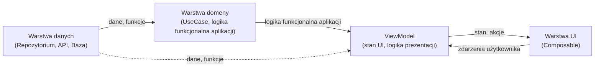

# Architektura aplikacji

## Dlaczego zadbanie o architekturę aplikacji jest istotne?

Dobrze zaprojektowana architektura aplikacji to klucz do sukcesu każdego większego projektu. W kontekście Jetpack Compose i nowoczesnych aplikacji Android warto zadbać o architekturę, ponieważ:

- **Łatwiejsze utrzymanie kodu**  
  Jasny podział odpowiedzialności sprawia, że kod jest czytelny i łatwy do zrozumienia nawet po dłuższym czasie lub przez nowych członków zespołu.

- **Skalowalność**  
  Aplikacja z przemyślaną architekturą łatwiej się rozbudowuje o nowe funkcje bez ryzyka wprowadzania błędów w istniejących częściach.

- **Testowalność**  
  Oddzielenie tzw. logiki funkcjonalnej aplikacji od UI umożliwia łatwe pisanie testów jednostkowych i integracyjnych, co zwiększa niezawodność aplikacji.

- **Unikanie duplikacji i błędów**  
  Centralizacja logiki (np. w ViewModelu lub repozytorium) pozwala uniknąć powielania kodu i przypadkowych rozbieżności w zachowaniu aplikacji.

- **Lepsza współpraca w zespole**  
  Jasny podział na warstwy (UI, ViewModel, repozytorium) pozwala pracować równolegle kilku osobom bez konfliktów.

- **Łatwiejsza migracja i refaktoryzacja**  
  Gdy pojawią się nowe technologie lub potrzeba zmiany źródła danych, dobrze zaprojektowana architektura pozwala na łatwą wymianę poszczególnych warstw bez przepisywania całej aplikacji.

Dobra architektura to inwestycja, która procentuje przez cały cykl życia aplikacji – od prototypu, przez rozwój, aż po utrzymanie i rozwój nowych funkcji.

---

## Podstawowe zasady przy projektowaniu architektury aplikacji

Projektując nowoczesną architekturę aplikacji (szczególnie w Compose), warto kierować się poniższymi zasadami:

- **Single Source of Truth (SSOT)**  
  Każdy fragment stanu aplikacji powinien mieć jedno, centralne źródło prawdy (np. ViewModel lub repozytorium). Dzięki temu unika się niespójności i trudnych do znalezienia błędów.

- **Unidirectional Data Flow (UDF)**  
  Dane płyną w jedną stronę: od źródła (Model/Repozytorium) przez ViewModel do UI. Zdarzenia użytkownika wracają do ViewModelu, który aktualizuje stan. To upraszcza debugowanie i testowanie.

- **Separation of Concerns (SoC)**  
  Każda warstwa aplikacji ma jasno określoną odpowiedzialność: UI wyświetla dane, ViewModel zarządza logiką i stanem, repozytorium dostarcza dane.

- **Immutability (Niezmienność stanu)**  
  Stan przekazywany do funkcji kompozycyjnej powinien być niezmienny (np. `val`). Zmiany stanu powinny być realizowane przez ViewModel, a nie bezpośrednio w UI.

- **Testowalność**  
  Logika funkcjonalna aplikacji powinna być łatwa do przetestowania – należy jej unikać w funkjach kompozycyjnych i trzymać w ViewModelu lub repozytorium.


Stosowanie tych zasad pozwala budować aplikacje, które są czytelne, łatwe w utrzymaniu i odporne na błędy.

--- 

## Rekomendowana architektura aplikacji w Jetpack Compose

Tworząc aplikacje z użyciem Jetpack Compose, warto stosować nowoczesne podejście do architektury, które zapewnia czytelność, łatwość testowania i rozdzielenie odpowiedzialności.

### MVVM — Model-View-ViewModel

**MVVM** to wzorzec architektoniczny rekomendowany przez Google dla aplikacji Android. Dzieli aplikację na trzy warstwy:

| Warstwa | Odpowiedzialność |
|---|---|
| **Model** | Dane i logika dostępu do nich (repozytoria, baza danych, API) |
| **ViewModel** | Pośrednik między modelem a widokiem; przechowuje i przetwarza stan UI, reaguje na zdarzenia użytkownika |
| **View (UI)** | Wyświetla stan dostarczony przez ViewModel; w Compose to funkcje kompozycyjne |

Kluczowa zasada MVVM: **View obserwuje ViewModel, a nie odwrotnie**. ViewModel nie ma wiedzy o tym, który ekran aktualnie wyświetla jego dane — dzięki temu można go łatwo testować bez uruchamiania UI.

W Jetpack Compose MVVM realizowane jest przez **Unidirectional Data Flow (UDF)** — dane przepływają zawsze w jednym kierunku:

```
Model/Repozytorium  →  ViewModel (stan UI)  →  Composable (widok)
                                ↑                      |
                                └──── zdarzenia ────────┘
```

- ViewModel udostępnia stan jako `StateFlow` — funkcja kompozycyjna obserwuje go i odświeża się automatycznie przy każdej zmianie.
- Funkcja kompozycyjna przekazuje zdarzenia użytkownika (kliknięcia, wpisywany tekst) do ViewModelu przez lambdy.
- ViewModel aktualizuje stan na podstawie zdarzeń i w razie potrzeby pobiera dane z repozytorium.

Dzięki UDF zawsze wiadomo, skąd pochodzą dane i gdzie są modyfikowane — zmiany stanu są kontrolowane, logika funkcjonalna jest oddzielona od UI, co ułatwia debugowanie i testowanie.

### Podział na warstwy

W praktyce aplikacja dzieli się na kilka warstw:



- **Warstwa UI (prezentacji)**  
  Zawiera funkcje kompozycyjne odpowiadające za wyświetlanie danych i obsługę interakcji użytkownika. UI nie powinno zawierać logiki funkcjonalnej aplikacji ani bezpośredniego dostępu do danych.  
  **ViewModel znajduje się w warstwie UI jako tzw. state holder** – zarządza stanem ekranu i udostępnia go funkcjom kompozycyjnym, ale nie powinien zawierać logiki dostępu do danych ani logiki funkcjonalnej (te powinny być w repozytoriach i warstwie domeny).

- **Warstwa danych (Data Layer)**  
  Odpowiada za dostęp do danych – zarówno lokalnych (baza danych, pliki), jak i zdalnych (API, sieć). Najczęściej realizowana przez repozytoria.

- **(Opcjonalnie) Warstwa domeny (Domain Layer)**  
  W większych projektach można wydzielić warstwę domeny z logiką funkcjonalną niezależną od źródeł danych i UI, co ułatwia testowanie i rozdzielenie odpowiedzialności.


## Główne elementy architektury Compose

| Element | Rola |
|---|---|
| **Composable (UI)** | Wyświetla dane i obsługuje interakcje; nie zawiera logiki funkcjonalnej ani bezpośredniego dostępu do danych |
| **ViewModel** | Przechowuje stan UI i obsługuje logikę prezentacji; przeżywa zmiany konfiguracji |
| **Repository** | Abstrakcja nad źródłami danych (sieć, baza, pliki); ViewModel korzysta wyłącznie z repozytorium |
| **Model** | Klasy danych (`data class`) reprezentujące dane aplikacji |

> **Informacja**: Szczegółowy opis ViewModelu znajduje się w kolejnej sekcji.

---

## Repozytorium — przykład implementacji

Repozytorium stanowi warstwę pośrednią między ViewModelem a źródłami danych. Definiuje się je najczęściej przez interfejs — dzięki temu implementację można łatwo podmienić w testach.

```kotlin
// Interfejs repozytorium
interface UserRepository {
    suspend fun getUser(id: String): User
    fun observeUsers(): Flow<List<User>>
}

// Implementacja korzystająca z API i lokalnej bazy danych
class UserRepositoryImpl(
    private val api: UserApi,
    private val dao: UserDao
) : UserRepository {

    override suspend fun getUser(id: String): User =
        dao.getUser(id) ?: api.fetchUser(id).also { dao.insertUser(it) }

    override fun observeUsers(): Flow<List<User>> = dao.observeAll()
}
```

ViewModel korzysta z repozytorium wyłącznie przez interfejs:

```kotlin
class UserViewModel(private val repository: UserRepository) : ViewModel() {

    private val _users = MutableStateFlow<List<User>>(emptyList())
    val users: StateFlow<List<User>> = _users

    init {
        viewModelScope.launch {
            repository.observeUsers().collect { _users.value = it }
        }
    }
}
```

---

## ViewModel i przechowywanie stanu (StateFlow, MutableStateFlow)

**ViewModel** to komponent architektury Androida, który odpowiada za przechowywanie i zarządzanie stanem UI oraz logiką prezentacji. Jego główną zaletą jest to, że przeżywa zmiany konfiguracji (np. obrót ekranu) — stan ekranu zostaje zachowany.

Aby korzystać z funkcji `viewModel()` w funkcji kompozycyjnej, wymagane są zależności:
```kotlin
// build.gradle.kts
implementation("androidx.lifecycle:lifecycle-viewmodel-compose:2.8.0")
implementation("androidx.lifecycle:lifecycle-runtime-compose:2.8.0")
```

Druga zależność udostępnia `collectAsStateWithLifecycle()` — zalecaną alternatywę dla `collectAsState()`, która zatrzymuje zbieranie gdy funkcja kompozycyjna nie jest aktywna (np. aplikacja działa w tle), oszczędzając zasoby baterii.

#### Prosty przykład

```kotlin
class MyViewModel : ViewModel() {
    // Wewnętrzny, modyfikowalny stan
    private val _uiState = MutableStateFlow("Początkowy stan")
    // Publiczny, tylko do odczytu
    val uiState: StateFlow<String> = _uiState

    fun updateState(newValue: String) {
        _uiState.value = newValue
    }
}
```


```kotlin
@Composable
fun MyScreen(viewModel: MyViewModel = viewModel()) {
    val uiState by viewModel.uiState.collectAsStateWithLifecycle()

    Column {
        Text(text = uiState)
        Button(onClick = { viewModel.updateState("Nowy stan") }) {
            Text("Zmień stan")
        }
    }
}
```

### Przechowywanie stanu w ViewModelu

W nowoczesnych aplikacjach Compose do przechowywania i emitowania stanu służą typy z biblioteki Kotlin Coroutines — `Flow`, `StateFlow` i `SharedFlow`:

| Typ | Opis | Zastosowanie w MVVM |
|---|---|---|
| **`Flow<T>`** | Strumień danych emitujący wiele wartości asynchronicznie; nie przechowuje ostatniej wartości | Wyniki z bazy danych / API (np. `dao.observeAll()`) |
| **`StateFlow<T>`** | Specjalny `Flow` z jedną bieżącą wartością (aktywny strumień ang. hot stream); nowi odbiorcy natychmiast otrzymują aktualną wartość | Trwały stan UI w ViewModelu |
| **`SharedFlow<T>`** | Aktywny strumień bez buforowania (domyślnie); subskrybenci otrzymują tylko nowe emisje | Jednorazowe zdarzenia: nawigacja, Snackbar |

- **`MutableStateFlow`** — mutowalny wariant `StateFlow`, używany wewnątrz ViewModelu do modyfikacji stanu.
- **`MutableSharedFlow`** — mutowalny wariant `SharedFlow`, używany do emitowania jednorazowych zdarzeń.
- W funkcji kompozycyjnej strumień `StateFlow`/`SharedFlow` z ViewModelu zbiera się przez `collectAsStateWithLifecycle()` (stan) lub `LaunchedEffect` (zdarzenia).
- **Jednoczesne wykorzystanie MutableStateFlow (do modyfikacji) oraz StateFlow (do odczytu) to tzw. enkapsulacja stanu** – tylko ViewModel może zmieniać stan, a UI ma dostęp wyłącznie do wersji tylko do odczytu. Dzięki temu unika się przypadkowych modyfikacji stanu z poziomu UI i zachowuje się pełną kontrolę nad przepływem danych.

#### Aktualizacja wartości MutableStateFlow

Wartość `MutableStateFlow` można aktualizować na dwa sposoby:

- **`.value = ...`** — przypisanie nowej wartości wprost; odpowiednie dla prostych typów i gdy nowa wartość nie zależy od poprzedniej.
- **`.update { ... }`** — aktualizacja z gwarancją spójności, w której blok lambda otrzymuje aktualną wartość i zwraca nową; zalecane gdy nowy stan zależy od poprzedniego (np. przy modyfikacji pola w `data class`).

```kotlin
// Prosty typ — przypisanie przez .value
private val _count = MutableStateFlow(0)

fun increment() {
    _count.value = _count.value + 1  // równoważnie: _count.value++
}

// Data class — aktualizacja przez .update
data class FormState(val name: String = "", val isLoading: Boolean = false)

private val _formState = MutableStateFlow(FormState())

fun onNameChange(name: String) {
    _formState.update { it.copy(name = name) }
}

fun setLoading(loading: Boolean) {
    _formState.update { it.copy(isLoading = loading) }
}
```

`update` jest szczególnie przydatne gdy stan jest obiektem `data class` z wieloma polami — `copy()` pozwala zmienić tylko wybrane pole, zachowując pozostałe wartości.


#### Obserwowanie strumieni (np. z repozytorium)

Gdy repozytorium zwraca `Flow<T>` (np. z bazy danych Room), ViewModel przekształca go w `StateFlow<T>` dostępny dla UI. Można to zrobić na dwa sposoby:

**1. `stateIn()` — zalecane podejście**

Operator `stateIn()` konwertuje `Flow` z repozytorium bezpośrednio na `StateFlow`, bez potrzeby ręcznego uruchamiania korutyny:

```kotlin
class ItemViewModel(private val repository: ItemRepository) : ViewModel() {

    val items: StateFlow<List<Item>> = repository.observeItems()
        .stateIn(
            scope = viewModelScope,
            started = SharingStarted.WhileSubscribed(5_000),
            initialValue = emptyList()
        )
}
```

Parametr `started` określa politykę uruchamiania i zatrzymywania zbierania danych:

| Wartość | Opis |
|---|---|
| `SharingStarted.WhileSubscribed(5_000)` | Zbieranie trwa, dopóki istnieje subskrybent; zatrzymuje się 5 s po zniknięciu ostatniego (przydatne przy rotacji ekranu) |
| `SharingStarted.Eagerly` | Zbieranie startuje natychmiast po utworzeniu `StateFlow` i nigdy nie jest zatrzymywane |
| `SharingStarted.Lazily` | Zbieranie startuje po pojawieniu się pierwszego subskrybenta i nigdy nie jest zatrzymywane |

W typowych ekranach Compose zaleca się `WhileSubscribed(5_000)`, które oszczędza zasoby gdy ekran nie jest widoczny. `Eagerly` stosuje się gdy dane muszą być dostępne natychmiast — jeszcze przed pierwszym subskrybentem.

- `initialValue` — wartość emitowana natychmiast, zanim napłyną dane z repozytorium.

**2. `collect` w `viewModelScope` — podejście jawne**

Alternatywnie można zebrać strumień ręcznie i zapisać wyniki do `MutableStateFlow`:

```kotlin
class ItemViewModel(private val repository: ItemRepository) : ViewModel() {

    private val _items = MutableStateFlow<List<Item>>(emptyList())
    val items: StateFlow<List<Item>> = _items

    init {
        viewModelScope.launch {
            repository.observeItems().collect { _items.value = it }
        }
    }
}
```

Podejście z `stateIn()` jest zwięźlejsze i zalecane gdy nie potrzeba dodatkowej transformacji danych przed zapisaniem stanu.

#### Łączenie wielu strumieni — `combine`

Operator `combine` pozwala połączyć dwa lub więcej strumieni `Flow` w jeden. Za każdym razem gdy którykolwiek ze strumieni źródłowych emituje nową wartość, blok transformujący jest wywoływany z aktualnymi wartościami wszystkich strumieni.

Typowe zastosowanie: połączenie danych z repozytorium z lokalnym stanem filtrowania/wyszukiwania w ViewModelu:

```kotlin
class ItemViewModel(private val repository: ItemRepository) : ViewModel() {

    private val _searchQuery = MutableStateFlow("")
    val searchQuery: StateFlow<String> = _searchQuery

    val items: StateFlow<List<Item>> = combine(
        repository.observeItems(),
        _searchQuery
    ) { items, query ->
        // Kod, który się wykona przy każdej zmianie któregokolwiek z  argumentów wywołania combine
        if (query.isBlank()) items
        else items.filter { it.name.contains(query, ignoreCase = true) }
    }.stateIn(
        scope = viewModelScope,
        started = SharingStarted.WhileSubscribed(5_000),
        initialValue = emptyList()
    )

    fun onSearchQueryChange(query: String) {
        _searchQuery.value = query
    }
}
```

`combine` jest szczególnie przydatne gdy stan UI zależy od kilku niezależnych źródeł danych, które mogą się zmieniać asynchronicznie.

### Tworzenie ViewModel - Manualne wstrzykiwanie zależności (Manual Dependency Injection)

Gdy ViewModel wymaga zależności (np. repozytorium), nie można go utworzyć bez argumentów domyślnym `viewModel()`. W takim przypadku stosuje się **`viewModelFactory`** z `androidx.lifecycle.viewmodel`:

```kotlin
import androidx.lifecycle.viewmodel.viewModelFactory
import androidx.lifecycle.ViewModel

class MyViewModel(private val repository: MyRepository) : ViewModel() { /* ... */ }
```

**Tworzenie fabryki i przekazanie do funkcji kompozycyjnej:**
```kotlin
@Composable
fun MyScreen(
    repository: MyRepository,
    viewModel: MyViewModel = viewModel(
        factory = viewModelFactory {
            initializer { MyViewModel(repository) }
        }
    )
) {
    // ...
}
```

Fabrykę można też zdefiniować bezpośrednio w companion object ViewModelu, co ułatwia jej ponowne użycie:

```kotlin
class MyViewModel(private val repository: MyRepository) : ViewModel() {
    companion object {
        fun factory(repository: MyRepository) = viewModelFactory {
            initializer { MyViewModel(repository) }
        }
    }
}

// W funkcji kompozycyjnej:
val viewModel: MyViewModel = viewModel(factory = MyViewModel.factory(repository))
```

Podejście to nie wymaga żadnych zewnętrznych bibliotek do DI — zależności przekazywane są ręcznie przez konstruktor.

### Odczytywanie argumentów nawigacji — SavedStateHandle

Gdy ViewModel potrzebuje argumentu przekazanego przez nawigację (np. identyfikatora elementu do wyświetlenia), korzysta się z `SavedStateHandle`. Przy manualnym DI obiekt ten pobiera się z `CreationExtras` przez `createSavedStateHandle()`:

```kotlin
class DetailViewModel(
    private val savedStateHandle: SavedStateHandle,
    private val repository: ItemRepository
) : ViewModel() {

    private val itemId: String = checkNotNull(savedStateHandle["itemId"])

    private val _item = MutableStateFlow<Item?>(null)
    val item: StateFlow<Item?> = _item

    init {
        viewModelScope.launch {
            _item.value = repository.getItem(itemId)
        }
    }

    companion object {
        fun factory(repository: ItemRepository) = viewModelFactory {
            initializer {
                val savedStateHandle = createSavedStateHandle()
                DetailViewModel(savedStateHandle, repository)
            }
        }
    }
}
```

W podejściu type-safe (Navigation 2.8+) argument można odczytać przez `savedStateHandle.toRoute<T>()`:

```kotlin
val destination = savedStateHandle.toRoute<Destinations.Detail>()
val itemId = destination.itemId
```

W bardziej rozbudowanych ekranach zaleca się przechowywanie stanu ekranu jako obiektu klasy sealed (sealed interface lub sealed class). Pozwala to jasno opisać różne możliwe stany UI (np. ładowanie, sukces, błąd) i ułatwia zarządzanie nimi w funkcji kompozycyjnej. Poniższy przykład korzysta z `viewModelScope` — scope korutyny powiązanego z cyklem życia ViewModelu, automatycznie anulowanego przy jego niszczeniu (więcej w rozdziale [Praca w tle: Korutyny](https://github.com/MarcinRod/AndroidLecture2025/blob/main/09%20Zadania%20w%20tle%20-%20Korutyny.md)).

**Przykład:**

```kotlin
// Definicja stanu ekranu
sealed interface UiState {
    object Loading : UiState
    data class Success(val data: String) : UiState
    data class Error(val message: String) : UiState
}

// ViewModel z enkapsulacją stanu
class MyViewModel : ViewModel() {
    private val _uiState = MutableStateFlow<UiState>(UiState.Loading)
    val uiState: StateFlow<UiState> = _uiState

    fun loadData() {
        viewModelScope.launch {
            try {
                _uiState.value = UiState.Loading
                val result = fetchDataFromNetwork() // np. suspend fun
                _uiState.value = UiState.Success(result)
            } catch (e: Exception) {
                _uiState.value = UiState.Error("Wystąpił błąd")
            }
        }
    }
}
```

**W funkcji kompozycyjnej:**

```kotlin
@Composable
fun MyScreen(viewModel: MyViewModel = viewModel()) {
    val uiState by viewModel.uiState.collectAsStateWithLifecycle()

    when (val state = uiState) {
        is UiState.Loading -> CircularProgressIndicator()
        is UiState.Success -> Text(state.data)
        is UiState.Error -> Text(state.message, color = Color.Red)
    }
}
```

Takie podejście pozwala w prosty sposób obsłużyć różne scenariusze w UI i zachować pełną kontrolę nad przepływem stanu.

### Jednorazowe zdarzenia — SharedFlow

`StateFlow` reprezentuje **stan trwały** — jego ostatnia wartość jest ponownie emitowana po rotacji ekranu lub powrocie do funkcji kompozycyjnej. Do **jednorazowych zdarzeń** (nawigacja po zapisaniu formularza, wyświetlenie Snackbara) należy używać `SharedFlow`, który domyślnie nie buforuje zdarzeń.

```kotlin
sealed interface FormEvent {
    data object NavigateBack : FormEvent
    data class ShowError(val message: String) : FormEvent
}

class FormViewModel : ViewModel() {

    private val _events = MutableSharedFlow<FormEvent>()
    val events: SharedFlow<FormEvent> = _events

    fun save(data: String) {
        viewModelScope.launch {
            // logika zapisu...
            _events.emit(FormEvent.NavigateBack)
        }
    }
}
```

**W funkcji kompozycyjnej — zbieranie zdarzeń przez `LaunchedEffect`:**
```kotlin
@Composable
fun FormScreen(
    viewModel: FormViewModel = viewModel(),
    onNavigateBack: () -> Unit
) {
    LaunchedEffect(Unit) {
        viewModel.events.collect { event ->
            when (event) {
                is FormEvent.NavigateBack -> onNavigateBack()
                is FormEvent.ShowError -> { /* pokaż Snackbar */ }
            }
        }
    }
    // reszta UI...
}
```


## Tworzenie własnego `Flow` w warstwie repozytorium

Gdy źródło danych nie udostępnia natywnie `Flow` (np. system oparty na listenerach, sensor, gniazdo sieciowe), można opakować je ręcznie. Takie strumienie tworzy się w warstwie repozytorium — nie w ViewModelu ani w funkcji kompozycyjnej.

### `flow { }` — strumień tworzony sekwencyjnie

Blok `flow { }` służy do tworzenia **pasywnych strumieni** — strumień startuje dopiero gdy pojawi się obserwator. Wewnątrz bloku wywołuje się `emit()` aby przekazać kolejną wartość.

```kotlin
fun observeTemperature(): Flow<Float> = flow {
    while (true) {
        val temp = readTemperatureFromSensor()  // odczyt z sensora
        emit(temp)                              // przekazanie wartości do strumienia
        delay(1_000)                            // odczyt co sekundę
    }
}
```

> Pasywny `Flow` nie wymaga jawnego anulowania po stronie twórcy — zakończenie zbierania (np. przez `stateIn` lub usunięcie ViewModelu) automatycznie przerywa blok `flow { }`.

### `callbackFlow { }` — opakowanie źródła opartego na listenerach

Gdy źródło danych przekazuje wyniki przez listenery (np. `BroadcastReceiver`, Firebase, API systemowe), stosuje się `callbackFlow { }`. Pozwala on na rejestrację listenera, przekazywanie wartości przez `trySend()` oraz jawne zwalnianie zasobów w `awaitClose { }`.

```kotlin
fun observeNetworkStatus(context: Context): Flow<Boolean> = callbackFlow {
    val manager = context.getSystemService(ConnectivityManager::class.java)

    val networkCallback = object : ConnectivityManager.NetworkCallback() {
        override fun onAvailable(network: Network) {
            trySend(true)   // sieć dostępna
        }
        override fun onLost(network: Network) {
            trySend(false)  // brak sieci
        }
    }

    manager.registerDefaultNetworkCallback(networkCallback)

    awaitClose {
        manager.unregisterNetworkCallback(networkCallback)  // zwolnienie zasobów
    }
}
```

- `trySend()` — przekazuje wartość do strumienia bez zawieszania bieżącego wątku; zalecane wewnątrz listenerów działających na wątkach innych niż Main.
- `awaitClose { }` — blok wykonywany gdy obserwator przestaje zbierać dane (np. ViewModel został usunięty, funkcja kompozycyjna opuściła kompozycję); tu należy wyrejestrować listener.


---
## Zalecenia i dobre praktyki

- **Stan UI należy przechowywać w ViewModelu**  
  Cały stan ekranu należy trzymać w ViewModelu (`StateFlow`, `MutableStateFlow`). Dzięki temu stan przeżywa zmiany konfiguracji i jest łatwy do testowania.

- **Funkcje kompozycyjne powinny być możliwie proste**  
  Funkcje kompozycyjne powinny tylko wyświetlać dane i przekazywać zdarzenia do ViewModelu. Logiki funkcjonalnej i zarządzania stanem należy unikać bezpośrednio w funkcji kompozycyjnej — należy je umieszczać w ViewModelu lub warstwie domeny.

- **Enkapsulacja stanu**  
  Do UI należy udostępniać wyłącznie wersję stanu do odczytu (`StateFlow`), a modyfikacje wykonywać tylko w ViewModelu. Chroni to przed przypadkowymi zmianami stanu z poziomu UI.

- **Jednorazowe zdarzenia przez `SharedFlow`**  
  Do nawigacji, wyświetlania Snackbarów i innych jednorazowych zdarzeń należy używać `SharedFlow`, a nie `StateFlow`. `StateFlow` przechowuje ostatnią wartość i ponownie ją emituje — co może wywołać niechciane skutki po rotacji ekranu.

- **`stateIn()` zamiast ręcznego `collect` w `init`**  
  Gdy ViewModel obserwuje `Flow` z repozytorium, zaleca się konwersję przez `stateIn(viewModelScope, SharingStarted.WhileSubscribed(5_000), initialValue)` zamiast ręcznego `viewModelScope.launch { flow.collect { ... } }`. Podejście z `stateIn` jest zwięźlejsze i poprawnie zatrzymuje zbieranie gdy ekran nie jest widoczny.

- **`collectAsStateWithLifecycle()` zamiast `collectAsState()`**  
  W funkcjach kompozycyjnych do zbierania `StateFlow` należy używać `collectAsStateWithLifecycle()`, która wstrzymuje zbieranie gdy aplikacja działa w tle, oszczędzając zasoby baterii.


---

## Więcej informacji

- [Oficjalna dokumentacja architektury Compose](https://developer.android.com/jetpack/compose/architecture)
- [Nowoczesna architektura Androida – przewodnik](https://developer.android.com/topic/architecture)
- [Przykładowy projekt Compose: Now in Android](https://github.com/android/nowinandroid)

---

###  **Następny temat:** [Bazy danych - Room](https://github.com/MarcinRod/AndroidLecture2025/blob/main/11%20Bazy%20danych%20-%20Room.md)