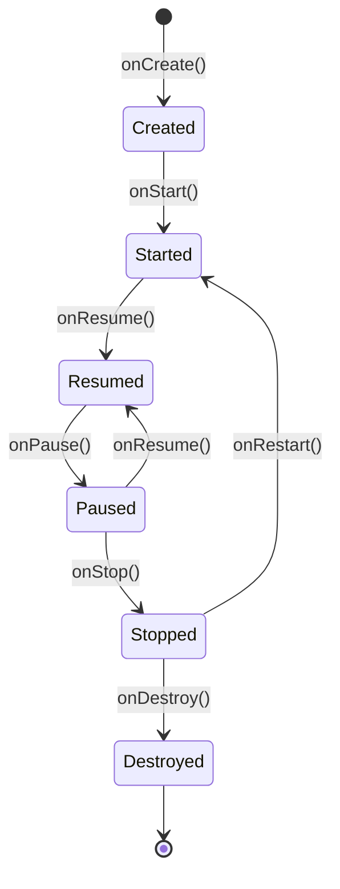

# Activity and Its Lifecycle

---

## What is `Activity`?

**`Activity`** is one of the fundamental components of an Android application. It represents **a single screen of user interface** – everything the user sees and interacts with at a given moment.

Every application must have at least one activity, usually the main screen (`MainActivity`). Activity manages screen lifecycle, responds to user actions, handles system events (e.g., screen rotation, app return), and is responsible for displaying and updating interface.

In traditional Android, activity is defined as a class inheriting from `Activity` or `AppCompatActivity`, e.g.:

```kotlin
class MainActivity : ComponentActivity() {
    override fun onCreate(savedInstanceState: Bundle?) {
        super.onCreate(savedInstanceState)
        setContent {
            MyApp()
        }
    }
}
```

> **`AndroidManifest.xml` File:** Every activity must be declared in `AndroidManifest.xml` file – without this Android system won't know about it. Manifest file is discussed in separate chapter; here it's important that just writing the class isn't enough.

---

## Single Activity Architecture

Modern Android applications (especially those based on Jetpack Compose) follow the **Single Activity** pattern – entire application runs within single Activity, with individual screens being separate composable functions navigated between using **Jetpack Navigation**.

```
MainActivity
 └── NavHost
      ├── HomeScreen()       ← composable
      ├── DetailsScreen()    ← composable
      └── ProfileScreen()    ← composable
```

This approach has several advantages compared to classic multiple-Activity model:

| Feature                | Multiple Activities              | Single Activity + Compose          |
|------------------------|----------------------------------|------------------------------------|
| Navigation             | Intents (`Intent`)               | `NavController`                    |
| Data Passing           | `Intent.putExtra()`              | Navigation arguments or ViewModel  |
| Transition Animations  | Harder to customize              | Built-in Navigation Compose        |
| State Sharing          | Complicated (Intent or Bus)      | Easy through shared ViewModel       |

> Navigation in Compose is discussed in separate chapter (Chapter 6: [Navigation Component](ENt/06%20Navigation%20Component.md)). This course creates applications based on Single Activity.

---

## Activity Lifecycle

Activities in Android follow a lifecycle managed by operating system. Lifecycle consists of **series of automatically called methods** by system depending on user interaction, device state, or resources.

---

## Lifecycle Diagram



---

## Lifecycle Methods Description

| Method        | Description |
|---------------|-------------|
| `onCreate()`  | Called when activity is first created. Here initialize UI, set views, read `savedInstanceState`, register listeners, initialize ViewModel, open database connections, etc. |
| `onStart()`   | Activity becomes visible to user but not yet in foreground. Can start animations here or prepare resources needed when activity is visible. |
| `onResume()`  | Activity gains focus and becomes active (ready for interaction). Resume suspended operations here, e.g., video playback, sensor startup, animation resume. |
| `onPause()`   | Activity loses focus, e.g., after opening another activity or dialog. Save temporary data, stop animations, pause media playback, unregister receivers, stop sensors here. |
| `onStop()`    | Activity is no longer visible. Release resources, save data to persistent storage, close database connections, stop heavy operations here. |
| `onRestart()` | Called when activity returns to foreground after stopping (`onStop`). Can reinitialize resources released in `onStop()`. |
| `onDestroy()` | Activity is being destroyed – e.g., after closing or configuration change. Release all resources, unregister listeners, close connections, stop threads here. |

---

### Lifecycle Methods Usage Examples

- **onCreate()**: UI initialization, adapter setup, fetch data from database, register listeners.
- **onStart()**: Start animations, register BroadcastReceiver, check permissions.
- **onResume()**: Resume music playback, start camera, begin location tracking.
- **onPause()**: Stop video playback, save form draft, unregister sensors.
- **onStop()**: Save data to database, close API connection, stop services.
- **onDestroy()**: Free memory, close network connections, unregister listeners.

---

## Why This Matters

Understanding activity lifecycle allows:

- **Battery and resource saving**  
  Example: stopping video, music playback, or sensors in `onPause()` and `onStop()` to avoid wasting energy when user isn't using application.

- **Avoiding orientation change errors**  
  Example: saving form state or list scroll position in `onSaveInstanceState()` and restoring in `onCreate()` so user doesn't lose data after screen rotation.

- **Preserving application state**  
  Example: saving temporary data (e.g., text in edit field) during transition to another application so user can continue work after return.

- **Better external resource control**  
  Example: closing database connections, stopping location services, unregistering system receivers to prevent memory leaks and unnecessary resource waste.

- **Security and privacy**  
  Example: hiding sensitive data or logging out user after prolonged inactivity.

- **Improved application performance**  
  Example: loading large data only when activity is visible, not in background.

Proper lifecycle management ensures application runs smoothly, stays stable, and doesn't waste device resources.

---

## Configuration Changes

**Configuration change** is system event destroying and recreating Activity. Most common example is **screen rotation**, but also includes system language change, window size change (multi-window mode), or keyboard connection.

### Process During Screen Rotation

```
onPause() → onStop() → onDestroy()  ← old instance
onCreate() → onStart() → onResume() ← new instance
```

Every Activity class field is reset to default values. Unprotected data (e.g., filled form, fetched list) will be lost.

### Solutions

- **`ViewModel`** – recommended approach. Data stored in ViewModel survives configuration change because ViewModel isn't destroyed with Activity.
- **`rememberSaveable`** (Compose) – stores composable function state in `Bundle` which is restored after configuration change. Equivalent of `onSaveInstanceState` for Compose.
- **`onSaveInstanceState`** – traditional mechanism saving simple data (strings, numbers) to `Bundle` before Activity destruction.

> In this course main tool for handling configuration changes will be **ViewModel**, discussed in application architecture chapter ([Application Architecture](ENt/10%20Application%20Architecture.md)).

---

## What Is `Context`?

**`Context`** is one of Android's most important classes. It represents **current application state** and provides access to system resources, files, databases, preferences, system services, and environment information.

### Most Important Applications of `Context`

- **Resource access**: e.g., `getString(R.string.app_name)`, `getDrawable(R.drawable.icon)`
- **Launching new activities and services**: e.g., `startActivity(intent)`, `startService(intent)`
- **File and database access**: e.g., `openFileInput()`, `openOrCreateDatabase()`
- **Preferences access**: e.g., `getSharedPreferences()`
- **Getting system services**: e.g., `getSystemService(Context.CONNECTIVITY_SERVICE)`

### Typical Classes Inheriting from `Context`

- **`Application`** – global context, lives as long as application.
- **`Activity`** – context associated with single screen.
- **`Service`** – context associated with service.
- **`BroadcastReceiver`** – available briefly in `onReceive()` method.

### `Context` in Compose

Compose doesn't have direct context access (like Activity through `this`), so helper functions are used.

In composable functions use:

```kotlin
val context = LocalContext.current
```

### `Context` Usage Examples in Compose

- **Resource access:**

  ```kotlin
  val context = LocalContext.current
  val appName = context.getString(R.string.app_name)
  ```

- **Start new activity:**

  ```kotlin
  val context = LocalContext.current
  Button(onClick = {
      val intent = Intent(context, DetailsActivity::class.java)
      context.startActivity(intent)
  }) {
      Text("Go Further")
  }
  ```

- **Get system service:**

  ```kotlin
  val context = LocalContext.current
  val connectivityManager = context.getSystemService(Context.CONNECTIVITY_SERVICE) as ConnectivityManager
  ```

### Important Tips

- **Don't store `Context` references outside composable functions.**  
  Current context should be obtained through `LocalContext.current` in composable body or onClick lambda.

- **For global operations** (e.g., repositories, ViewModel) use `context.applicationContext`.
- **For UI-related operations** (e.g., Toast, startActivity) use current context from `LocalContext`.

---

## Additional Materials and Documentation

- [Official Android Documentation – Activity](https://developer.android.com/guide/components/activities/intro)
- [Activity Lifecycle Guide](https://developer.android.com/guide/components/activities/activity-lifecycle)
- [Official Android Documentation – Context](https://developer.android.com/reference/android/content/Context)
- [Jetpack Compose – Context Access](https://developer.android.com/jetpack/compose/side-effects#context)

---

### **Next topic:** [Resources](ENt/05%20Resources.md)
