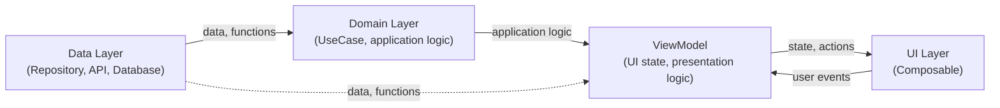

# Application Architecture

## Why Proper Application Architecture Matters

Well-designed application architecture is key to success of any larger project. In context of Jetpack Compose and modern Android applications, good architecture matters because:

- **Easier code maintenance**  
  Clear separation of responsibility makes code readable and understandable even after long time or by new team members.

- **Scalability**  
  Application with well-thought architecture easier to extend with new features without risk of introducing bugs in existing parts.

- **Testability**  
  Separation of application logic from UI enables easy writing of unit and integration tests, increasing application reliability.

- **Avoiding duplication and errors**  
  Centralizing logic (e.g., in ViewModel or repository) prevents code duplication and accidental behavior inconsistencies.

- **Better team collaboration**  
  Clear separation into layers (UI, ViewModel, repository) allows multiple people to work in parallel without conflicts.

- **Easier migration and refactoring**  
  When new technologies appear or need to change data source, well-designed architecture enables easy replacement of individual layers without rewriting entire application.

Good architecture is investment that pays off throughout application lifecycle – from prototype, through development, to maintenance and new features.

---

## Basic Principles for Application Architecture Design

When designing modern application architecture (especially in Compose), worth following these principles:

- **Single Source of Truth (SSOT)**  
  Each part of application state should have one, central source of truth (e.g., ViewModel or repository). This prevents inconsistencies and hard-to-find bugs.

- **Unidirectional Data Flow (UDF)**  
  Data flows one way: from source (Model/Repository) through ViewModel to UI. User events return to ViewModel, which updates state. This simplifies debugging and testing.

- **Separation of Concerns (SoC)**  
  Each application layer has clearly defined responsibility: UI displays data, ViewModel manages logic and state, repository provides data.

- **Immutability (State Immutability)**  
  State passed to composable function should be immutable (e.g., `val`). State changes should be realized by ViewModel, not directly in UI.

- **Testability**  
  Application logic should be easy to test – should avoid it in composable functions and keep in ViewModel or repository.

Applying these principles allows building applications that are readable, easy to maintain and resistant to bugs.

---

## Recommended Application Architecture in Jetpack Compose

When creating applications with Jetpack Compose, worth applying modern approach to architecture that ensures readability, testability and separation of responsibility.

### MVVM — Model-View-ViewModel

**MVVM** is architectural pattern recommended by Google for Android applications. Divides application into three layers:

| Layer | Responsibility |
|---|---|
| **Model** | Data and logic for accessing them (repositories, database, API) |
| **ViewModel** | Intermediary between model and view; stores and processes UI state, responds to user events |
| **View (UI)** | Displays state provided by ViewModel; in Compose these are composable functions |

Key MVVM principle: **View observes ViewModel, not other way around**. ViewModel has no knowledge of which screen currently displays its data – this makes it easy to test without running UI.

In Jetpack Compose MVVM is realized through **Unidirectional Data Flow (UDF)** – data always flows one direction:

```
Model/Repository  →  ViewModel (UI state)  →  Composable (view)
                                ↑                      |
                                └──── events ─────────┘
```

- ViewModel provides state as `StateFlow` – composable function observes it and automatically updates on every change.
- Composable function passes user events (clicks, typed text) to ViewModel through lambdas.
- ViewModel updates state based on events and fetches data from repository if needed.

Thanks to UDF, always clear where data comes from and where it's modified – state changes are controlled, logic is separated from UI, which eases debugging and testing.

### Division into Layers

In practice, application divides into several layers:



- **UI (Presentation) Layer**  
  Contains composable functions responsible for displaying data and handling user interactions. UI shouldn't contain application logic or direct data access.  
  **ViewModel is in UI layer as state holder** – manages screen state and provides it to composable functions, but shouldn't contain data access logic or application logic (these should be in repositories and domain layer).

- **Data Layer**  
  Responsible for data access – both local (database, files) and remote (API, network). Most often realized by repositories.

- **(Optionally) Domain Layer**  
  In larger projects can separate domain layer with application logic independent of data sources and UI, which eases testing and separation of responsibility.

---

## Main Elements of Compose Architecture

| Element | Role |
|---|---|
| **Composable (UI)** | Displays data and handles interactions; doesn't contain application logic or direct data access |
| **ViewModel** | Stores UI state and handles presentation logic; survives configuration changes |
| **Repository** | Abstraction over data sources (network, database, files); ViewModel uses only repository |
| **Model** | Data classes (`data class`) representing application data |

> **Information**: Detailed description of ViewModel is in next section.

---

## Repository — Example Implementation

Repository is intermediary layer between ViewModel and data sources. Usually defined through interface – thanks to this implementation can easily be substituted in tests.

```kotlin
// Repository interface
interface UserRepository {
    suspend fun getUser(id: String): User
    fun observeUsers(): Flow<List<User>>
}

// Implementation using API and local database
class UserRepositoryImpl(
    private val api: UserApi,
    private val dao: UserDao
) : UserRepository {

    override suspend fun getUser(id: String): User =
        dao.getUser(id) ?: api.fetchUser(id).also { dao.insertUser(it) }

    override fun observeUsers(): Flow<List<User>> = dao.observeAll()
}
```

ViewModel uses repository only through interface:

```kotlin
class UserViewModel(private val repository: UserRepository) : ViewModel() {

    private val _users = MutableStateFlow<List<User>>(emptyList())
    val users: StateFlow<List<User>> = _users

    init {
        viewModelScope.launch {
            repository.observeUsers().collect { _users.value = it }
        }
    }
}
```

---

## ViewModel and State Management (StateFlow, MutableStateFlow)

**ViewModel** is Android architecture component responsible for storing and managing UI state and presentation logic. Its main advantage is surviving configuration changes (e.g., screen rotation) – screen state is preserved.

To use `viewModel()` function in composable function, require dependencies:
```kotlin
// build.gradle.kts
implementation("androidx.lifecycle:lifecycle-viewmodel-compose:2.8.0")
implementation("androidx.lifecycle:lifecycle-runtime-compose:2.8.0")
```

Second dependency provides `collectAsStateWithLifecycle()` – recommended alternative to `collectAsState()`, which stops collecting when composable isn't active (e.g., app runs in background), saving battery.

#### Simple Example

```kotlin
class MyViewModel : ViewModel() {
    // Internal, mutable state
    private val _uiState = MutableStateFlow("Initial state")
    // Public, read-only
    val uiState: StateFlow<String> = _uiState

    fun updateState(newValue: String) {
        _uiState.value = newValue
    }
}
```

```kotlin
@Composable
fun MyScreen(viewModel: MyViewModel = viewModel()) {
    val uiState by viewModel.uiState.collectAsStateWithLifecycle()

    Column {
        Text(text = uiState)
        Button(onClick = { viewModel.updateState("New state") }) {
            Text("Change state")
        }
    }
}
```

### Storing State in ViewModel

In modern Compose applications, for storing and emitting state, types from Kotlin Coroutines library are used – `Flow`, `StateFlow` and `SharedFlow`:

| Type | Description | MVVM Usage |
|---|---|---|
| **`Flow<T>`** | Stream of data emitting multiple values asynchronously; doesn't store last value | Database / API results (e.g., `dao.observeAll()`) |
| **`StateFlow<T>`** | Special `Flow` with one current value (hot stream); new subscribers immediately get current value | Persistent UI state in ViewModel |
| **`SharedFlow<T>`** | Hot stream without buffering (by default); subscribers get only new emissions | One-time events: navigation, Snackbar |

- **`MutableStateFlow`** – mutable variant of `StateFlow`, used inside ViewModel to modify state.
- **`MutableSharedFlow`** – mutable variant of `SharedFlow`, used to emit one-time events.
- In composable function, stream `StateFlow`/`SharedFlow` from ViewModel is collected through `collectAsStateWithLifecycle()` (state) or `LaunchedEffect` (events).
- **Simultaneous use of MutableStateFlow (for modification) and StateFlow (for reading) is called state encapsulation** – only ViewModel can change state, UI has access only to read-only version. This prevents accidental state modifications from UI level and maintains full control over data flow.

#### Updating MutableStateFlow Value

Value of `MutableStateFlow` can be updated in two ways:

- **`.value = ...`** – assign new value directly; suitable for simple types and when new value doesn't depend on previous.
- **`.update { ... }`** – update with consistency guarantee, where lambda block receives current value and returns new one; recommended when new state depends on previous (e.g., modifying field in `data class`).

```kotlin
// Simple type — assignment through .value
private val _count = MutableStateFlow(0)

fun increment() {
    _count.value = _count.value + 1  // equivalently: _count.value++
}

// Data class — update through .update
data class FormState(val name: String = "", val isLoading: Boolean = false)

private val _formState = MutableStateFlow(FormState())

fun onNameChange(name: String) {
    _formState.update { it.copy(name = name) }
}

fun setLoading(loading: Boolean) {
    _formState.update { it.copy(isLoading = loading) }
}
```

`update` is particularly useful when state is `data class` with many fields – `copy()` changes only selected field, preserving other values.

#### Observing Streams (e.g., from Repository)

When repository returns `Flow<T>` (e.g., from Room database), ViewModel converts it to `StateFlow<T>` available for UI. Can be done in two ways:

**1. `stateIn()` – recommended approach**

Operator `stateIn()` converts repository `Flow` directly to `StateFlow`, without need for manual coroutine launching:

```kotlin
class ItemViewModel(private val repository: ItemRepository) : ViewModel() {

    val items: StateFlow<List<Item>> = repository.observeItems()
        .stateIn(
            scope = viewModelScope,
            started = SharingStarted.WhileSubscribed(5_000),
            initialValue = emptyList()
        )
}
```

Parameter `started` specifies policy for starting and stopping data collection:

| Value | Description |
|---|---|
| `SharingStarted.WhileSubscribed(5_000)` | Collection lasts while subscriber exists; stops 5s after last one disappears (useful on screen rotation) |
| `SharingStarted.Eagerly` | Collection starts immediately after creating `StateFlow` and never stops |
| `SharingStarted.Lazily` | Collection starts after first subscriber appears and never stops |

In typical Compose screens recommend `WhileSubscribed(5_000)`, which saves resources when screen isn't visible. `Eagerly` used when data must be available immediately – before first subscriber.

- `initialValue` – value emitted immediately, before data flows from repository.

**2. `collect` in `viewModelScope` – explicit approach**

Alternatively, can collect stream manually and store results to `MutableStateFlow`:

```kotlin
class ItemViewModel(private val repository: ItemRepository) : ViewModel() {

    private val _items = MutableStateFlow<List<Item>>(emptyList())
    val items: StateFlow<List<Item>> = _items

    init {
        viewModelScope.launch {
            repository.observeItems().collect { _items.value = it }
        }
    }
}
```

Approach with `stateIn()` is more concise and recommended when don't need additional data transformation before storing state.

#### Combining Multiple Streams – `combine`

Operator `combine` allows combining two or more `Flow` streams into one. Every time any source stream emits new value, transformation block is called with current values of all streams.

Typical use: combining data from repository with local filtering/search state in ViewModel:

```kotlin
class ItemViewModel(private val repository: ItemRepository) : ViewModel() {

    private val _searchQuery = MutableStateFlow("")
    val searchQuery: StateFlow<String> = _searchQuery

    val items: StateFlow<List<Item>> = combine(
        repository.observeItems(),
        _searchQuery
    ) { items, query ->
        // Code that executes on every change of any argument
        if (query.isBlank()) items
        else items.filter { it.name.contains(query, ignoreCase = true) }
    }.stateIn(
        scope = viewModelScope,
        started = SharingStarted.WhileSubscribed(5_000),
        initialValue = emptyList()
    )

    fun onSearchQueryChange(query: String) {
        _searchQuery.value = query
    }
}
```

`combine` particularly useful when UI state depends on several independent data sources that can change asynchronously.

### Creating ViewModel – Manual Dependency Injection

When ViewModel requires dependencies (e.g., repository), can't create it without arguments using default `viewModel()`. In such case use **`viewModelFactory`** from `androidx.lifecycle.viewmodel`:

```kotlin
import androidx.lifecycle.viewmodel.viewModelFactory
import androidx.lifecycle.ViewModel

class MyViewModel(private val repository: MyRepository) : ViewModel() { /* ... */ }
```

**Creating factory and passing to composable function:**
```kotlin
@Composable
fun MyScreen(
    repository: MyRepository,
    viewModel: MyViewModel = viewModel(
        factory = viewModelFactory {
            initializer { MyViewModel(repository) }
        }
    )
) {
    // ...
}
```

Factory can also be defined directly in ViewModel's companion object, which eases reuse:

```kotlin
class MyViewModel(private val repository: MyRepository) : ViewModel() {
    companion object {
        fun factory(repository: MyRepository) = viewModelFactory {
            initializer { MyViewModel(repository) }
        }
    }
}

// In composable function:
val viewModel: MyViewModel = viewModel(factory = MyViewModel.factory(repository))
```

This approach requires no external DI libraries – dependencies passed manually through constructor.

### Reading Navigation Arguments – SavedStateHandle

When ViewModel needs argument passed by navigation (e.g., item ID to display), use `SavedStateHandle`. With manual DI, this object is obtained from `CreationExtras` through `createSavedStateHandle()`:

```kotlin
class DetailViewModel(
    private val savedStateHandle: SavedStateHandle,
    private val repository: ItemRepository
) : ViewModel() {

    private val itemId: String = checkNotNull(savedStateHandle["itemId"])

    private val _item = MutableStateFlow<Item?>(null)
    val item: StateFlow<Item?> = _item

    init {
        viewModelScope.launch {
            _item.value = repository.getItem(itemId)
        }
    }

    companion object {
        fun factory(repository: ItemRepository) = viewModelFactory {
            initializer {
                val savedStateHandle = createSavedStateHandle()
                DetailViewModel(savedStateHandle, repository)
            }
        }
    }
}
```

In type-safe approach (Navigation 2.8+) argument can be read through `savedStateHandle.toRoute<T>()`:

```kotlin
val destination = savedStateHandle.toRoute<Destinations.Detail>()
val itemId = destination.itemId
```

In more elaborate screens recommend storing screen state as sealed class object. Allows clearly describing different possible UI states (e.g., loading, success, error) and eases management. Example below uses `viewModelScope` – coroutine scope tied to ViewModel lifecycle, automatically cancelled on its destruction (more in [Background Tasks - Coroutines](/En/09%20Background%20Tasks%20-%20Coroutines.md) chapter).

**Example:**

```kotlin
// Screen state definition
sealed interface UiState {
    object Loading : UiState
    data class Success(val data: String) : UiState
    data class Error(val message: String) : UiState
}

// ViewModel with state encapsulation
class MyViewModel : ViewModel() {
    private val _uiState = MutableStateFlow<UiState>(UiState.Loading)
    val uiState: StateFlow<UiState> = _uiState

    fun loadData() {
        viewModelScope.launch {
            try {
                _uiState.value = UiState.Loading
                val result = fetchDataFromNetwork() // e.g., suspend fun
                _uiState.value = UiState.Success(result)
            } catch (e: Exception) {
                _uiState.value = UiState.Error("Error occurred")
            }
        }
    }
}
```

**In composable function:**

```kotlin
@Composable
fun MyScreen(viewModel: MyViewModel = viewModel()) {
    val uiState by viewModel.uiState.collectAsStateWithLifecycle()

    when (val state = uiState) {
        is UiState.Loading -> CircularProgressIndicator()
        is UiState.Success -> Text(state.data)
        is UiState.Error -> Text(state.message, color = Color.Red)
    }
}
```

Such approach allows easily handling different scenarios in UI and maintaining full control over state flow.

### One-Time Events – SharedFlow

`StateFlow` represents **persistent state** – its last value is re-emitted after screen rotation or returning to composable function. For **one-time events** (navigation after form save, displaying Snackbar) should use `SharedFlow`, which by default doesn't buffer events.

```kotlin
sealed interface FormEvent {
    data object NavigateBack : FormEvent
    data class ShowError(val message: String) : FormEvent
}

class FormViewModel : ViewModel() {

    private val _events = MutableSharedFlow<FormEvent>()
    val events: SharedFlow<FormEvent> = _events

    fun save(data: String) {
        viewModelScope.launch {
            // save logic...
            _events.emit(FormEvent.NavigateBack)
        }
    }
}
```

**In composable function – collecting events through `LaunchedEffect`:**
```kotlin
@Composable
fun FormScreen(
    viewModel: FormViewModel = viewModel(),
    onNavigateBack: () -> Unit
) {
    LaunchedEffect(Unit) {
        viewModel.events.collect { event ->
            when (event) {
                is FormEvent.NavigateBack -> onNavigateBack()
                is FormEvent.ShowError -> { /* show Snackbar */ }
            }
        }
    }
    // rest of UI...
}
```

---

## Creating Custom `Flow` in Repository Layer

When data source doesn't natively provide `Flow` (e.g., listener-based system, sensor, network socket), can wrap it manually. Such streams created in repository layer – not in ViewModel or composable function.

### `flow { }` – Sequentially Created Stream

Block `flow { }` serves for creating **passive streams** – stream starts only when observer appears. Inside block call `emit()` to pass next value.

```kotlin
fun observeTemperature(): Flow<Float> = flow {
    while (true) {
        val temp = readTemperatureFromSensor()  // sensor reading
        emit(temp)                              // pass value to stream
        delay(1_000)                            // reading per second
    }
}
```

> Passive `Flow` doesn't require explicit cancellation from creator's side – stopping collection (e.g., by `stateIn` or ViewModel removal) automatically interrupts `flow { }` block.

### `callbackFlow { }` – Wrapping Listener-Based Source

When data source passes results through listeners (e.g., `BroadcastReceiver`, Firebase, system APIs), use `callbackFlow { }`. Allows registering listener, passing values through `trySend()` and explicitly releasing resources in `awaitClose { }`.

```kotlin
fun observeNetworkStatus(context: Context): Flow<Boolean> = callbackFlow {
    val manager = context.getSystemService(ConnectivityManager::class.java)

    val networkCallback = object : ConnectivityManager.NetworkCallback() {
        override fun onAvailable(network: Network) {
            trySend(true)   // network available
        }
        override fun onLost(network: Network) {
            trySend(false)  // no network
        }
    }

    manager.registerDefaultNetworkCallback(networkCallback)

    awaitClose {
        manager.unregisterNetworkCallback(networkCallback)  // release resources
    }
}
```

- `trySend()` – passes value to stream without suspending current thread; recommended inside listeners running on threads other than Main.
- `awaitClose { }` – block executed when observer stops collecting data (e.g., ViewModel destroyed, composable left composition); here unregister listener.

---

## Recommendations and Best Practices

- **Store UI state in ViewModel**  
  All screen state should be in ViewModel (`StateFlow`, `MutableStateFlow`). Survives configuration changes and easy to test.

- **Composable functions should be as simple as possible**  
  Composable functions should only display data and pass events to ViewModel. Avoid application logic and state management directly in composable function – place in ViewModel or domain layer.

- **State encapsulation**  
  Expose to UI only read-only version of state (`StateFlow`), perform modifications only in ViewModel. Prevents accidental state changes from UI level.

- **One-time events through `SharedFlow`**  
  For navigation, displaying Snackbars and other one-time events use `SharedFlow`, not `StateFlow`. `StateFlow` stores last value and re-emits it – which may cause unwanted effects after screen rotation.

- **`stateIn()` instead of manual `collect` in `init`**  
  When ViewModel observes `Flow` from repository, recommend converting through `stateIn(viewModelScope, SharingStarted.WhileSubscribed(5_000), initialValue)` instead of manual `viewModelScope.launch { flow.collect { ... } }`. Approach with `stateIn` is more concise and correctly stops collection when screen isn't visible.

- **`collectAsStateWithLifecycle()` instead of `collectAsState()`**  
  In composable functions, for collecting `StateFlow` use `collectAsStateWithLifecycle()`, which pauses collection when app runs in background, saving battery.

---

## More Information

- [Official Compose Architecture Documentation](https://developer.android.com/jetpack/compose/architecture)
- [Modern Android Architecture – Guide](https://developer.android.com/topic/architecture)
- [Sample Compose Project: Now in Android](https://github.com/android/nowinandroid)

---

### **Next topic:** [Databases - Room](/En/11%20Databases%20-%20Room.md)
